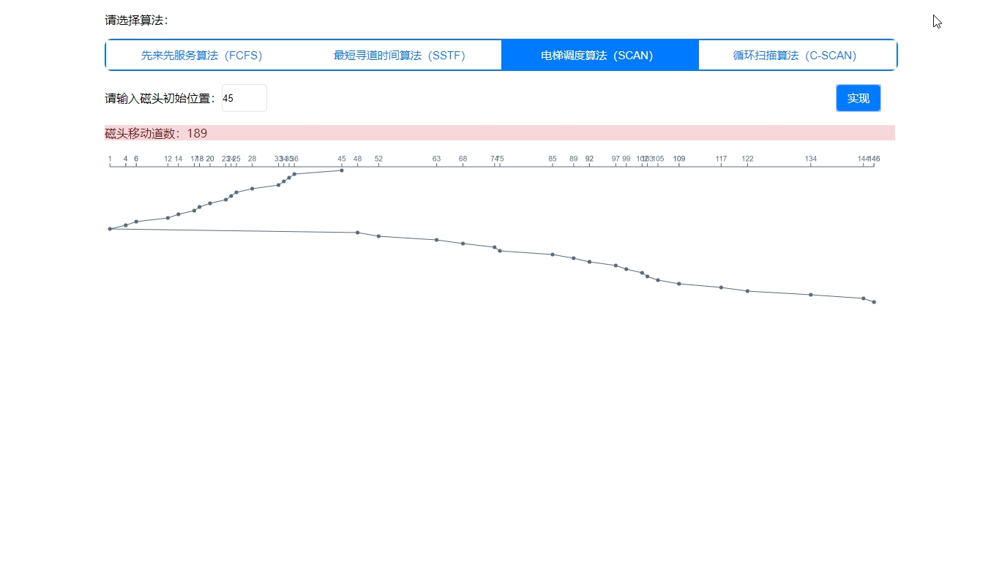

# canvas-demo

canvas模拟实现磁盘调度算法  Canvas simulation implements disk scheduling algorithm

项目地址：[canvas-demo](https://github.com/michwh/canvas-demo)

## [demo]( https://michwh.github.io/canvas-demo/main.html)

## 界面



## 实现过程

1.定义磁盘磁道总个数和需要生成的磁道序列个数：

```js
const track = 150;
const trackNumber = 40;
```

2.定义磁道序列数组

```js
let trackSequence = [];
```

3.生成trackNumber个磁道号序列

```js
generateTrackNumberSequence(trackNumber);
```

4.根据用户设置的算法和磁头初始位置形成相应的磁头轨迹数组

（1）先来先服务算法（FCFS）

>这种算法的思想比较容易理解。假设当前磁道在某一位置，依次处理服务队列里的每一个磁道，这样做的优点是处理起来比较简单，但缺点是磁头移动的距离和平均移动距离会很大。

实现方法：依次将磁头初始位置和磁道号序列放入磁头轨迹数组即可。

```js
function fcfs(headInitalPosition) {
  let headPath = [];
  headPath.push(headInitalPosition);
  return headPath.concat(trackSequence);
}
```

（2）最短寻道时间算法（SSTF）

>这种算法的本质是利用贪心算法来实现，假设当前磁道在某一位置，接下来处理的是距离当前磁道最近的磁道号，处理完成之后再处理离这个磁道号最近的磁道号，直到所有的磁道号都服务完了程序结束。这样做的优点是性能会优于FIFO算法，但是会产生距离当前磁道较远的磁道号长期得不到服务，也就是“饥饿”现象。

实现方法：形成一个当前磁头位置与磁道号序列里每个元素距离的数组distance，在distance里找到最小值并返回下标，通过该下标找到磁道号序列里面对应的磁道号，并将该磁道号加入磁头轨迹数组。一直循环上述方法。

```js
function sstf(headInitalPosition) {
  let headPath = [];
  headPath.push(headInitalPosition);
  let trackSequenceCopy = trackSequence.concat();
  for(let i = 0; i < trackSequence.length; i++) {
    let distance = trackSequenceCopy.map(key => Math.abs(key - headPath[i]));
    let minCoor = distance.min();
    headPath.push(trackSequenceCopy[minCoor]);
    trackSequenceCopy.splice(minCoor, 1);
  }
  return headPath;
}
```

（3）电梯调度算法（SCAN）

>先按照一个方向(比如从外向内扫描)，扫描的过程中依次访问要求服务的序列。当扫描到最里层的一个服务序列时反向扫描。

实现方法：将磁道序列里面小于等于初始磁头位置的元素按降序排好后插入磁头轨迹数组，再将磁道号序列里面大于初始磁头位置的元素按升序排好后插入磁头轨迹数组。

```js
function scan(headInitalPosition) {
  let headPath = [];
  headPath.push(headInitalPosition);
  headPath = headPath.concat((trackSequence.filter(key => key <= headInitalPosition)).sort((a, b) => b - a));
  headPath = headPath.concat((trackSequence.filter(key => key > headInitalPosition)).sort((a, b) => a - b));
  return headPath;
}
```

（4）循环扫描算法（C-SCAN）

>CSCAN算法的思想是，访问完最里面一个要求服务的序列之后，立即回到最外层欲访问磁道。也就是始终保持一个方向。故也称之为单向扫描调度算法。

实现方法：将磁道序列里面小于等于初始磁头位置的元素按降序排好后插入磁头轨迹数组，再将磁道号序列里面大于初始磁头位置的元素按降序排好后插入磁头轨迹数组。

```js
function cScan(headInitalPosition) {
  let headPath = [];
  headPath.push(headInitalPosition);
  headPath = headPath.concat((trackSequence.filter(key => key <= headInitalPosition)).sort((a, b) => b - a));
  headPath = headPath.concat((trackSequence.filter(key => key > headInitalPosition)).sort((a, b) => b - a));
  return headPath;
}
```

5.效果图

（1）绘制X轴及标记点

```js
/**
 * 绘制X轴及标记点
 * 
 * @param  {Array} xCoorArray 按升序排好的横坐标数组
 */
function drawCoordinateAxis(xCoorArray) {
  ctx.strokeStyle = '#566a80';
  ctx.fillStyle = '#566a80';
  ctx.lineWidth = 2;
  for(let i = 0; i < xCoorArray.length; i++) {
    const startXCoor = (xCoorArray[i] / track) * canvas.width;
    const endYCoor = (xCoorArray[i + 1] / track) * canvas.width;
    drawText(xCoorArray[i], startXCoor, 25); 
    drawLine(startXCoor, 40, endYCoor, 40);
    drawLine(startXCoor, 40, startXCoor, 30);
  }
}
```

（2）绘制折线图

```js
/**
 * 绘制折线图
 * 
 * @param  {Array} headPath 磁头轨迹数组
 */
function drawLineChart(headPath) {
  ctx.strokeStyle = '#566a80';
  ctx.fillStyle = '#566a80';
  ctx.lineWidth = 2;
  ctx.lineJoin = 'round';
  ctx.lineCap = 'round';

  //起点和终点纵坐标
  let startYCoor = 50;
  let endYCoor = 60;
  for(let i = 0; i < headPath.length; i++) {
    //起点和终点横坐标
    let startXCoor = (headPath[i] / track) * canvas.width;
    let endXCoor = (headPath[i + 1] / track) * canvas.width;
    if(startXCoor == endXCoor) {
      endYCoor = startYCoor;
    }
    drawPoint(startXCoor, startYCoor, 5);
    drawLine(startXCoor, startYCoor, endXCoor, endYCoor);
    startYCoor = endYCoor;
    endYCoor += 10;
  }
}
```

（3）显示磁头移动道数

将磁头轨迹数组中各元素的差值的绝对值放如数组moveNumber中，将moveNumber中各元素依次相加。

